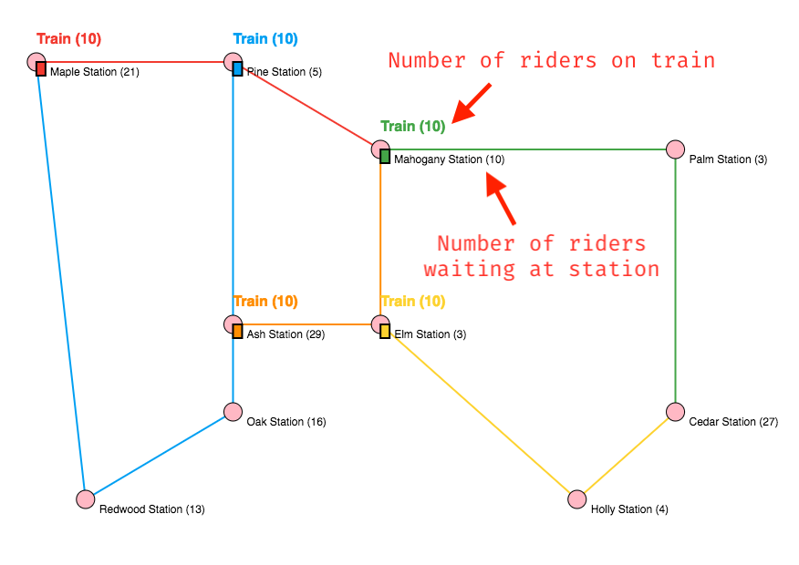

# Extra Credit

In this year, we are experimenting with data science topic in this intro level
course in hope of raising students' interests to Computer Science!

We will start by explaining what is *data science* and especially what part of
data science we are doing in this extra credit.

From there, it leads to the extra credit requirements – doing data aggregation
to answer questions and using these queries to lead actions.

## Data Science

Data Science is trending in last few years and it creates a lot of opportunities
to business. It can be simplified into 4 steps:

1. Data collection
2. Data storage
3. Data analytics
4. Data visualization

In data collection, a data scientist needs to collect data from various sources
of inputs from IoT (internet of things), Google Analytics, Kafka (unified log
storage) to databases (MySQL, Oracle, MongoDB ... etc.). From these source of
data, data scientist usually replicate the data into other storage in the favor
of processing later as well as not affecting the production performance in business.

As said earlier, the data scientist then needs to decide what storage to use to
store data coming from the *data collection* above. There are many different
choices here based on the data size and the processing needs.

In the spirit of this course, we will be picking MySQL and MongoDB. In industry,
you may or may not necessary be using any of these. In fact, you may not be using
either of it and needs to learn more data storage options in future!

After storing into the data storage, you will then need to *analyze* the data
and start to *create a story* around the data you get. This usually involves
data aggregation on huge set of data.

Optionally, some data scientists may also focus on applying Machine Learning
algorithm to help processing data and create a better story. This is quite
advance to discuss here so we will skip the discussion on this area.

After analyzing the data, the data scientist will usually need to present the
finding through graph or some other sort of visualization. This may involve
using charting libraries.

In summary, data science is about data pipeline going from collecting, storage,
analyzing to visualization. The goal is to create a story around the data so that
business can take action with confident!

## Extra Credit Requirements

Now, what you need to do is – analyze the pattern of metro trains. We will
provide you a MySQL database read access with a tons of data and continue growing
data over the entire time.

To start with, you can see the simple visualization of current metro state here:
http://138.68.57.231:8000/



You can find the number of riders and how train moves visually.

### The requirements

Your job here is to look at the data in MySQL table using the following credential:

```
host:
138.68.57.231

user:
cs1222students

password:
cs1222password

database:
metro
```

There should only be one table there. You can take a look now to start answering
following questions

1. Which station is the most busiest station?
2. Which line generates most profit?
3. When is the rush hour? (work hour as the hours riders shows up at station more)
4. Which line is the busiest line?
5. Which station has the most riders that cant get on train?

After answering above question, the next question is non-trivial but leads to
real world scenario. Which line should have more trains on it if so, how many
more train should be added? Use the above query to support your statement.
